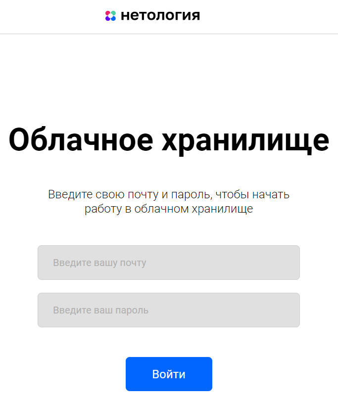
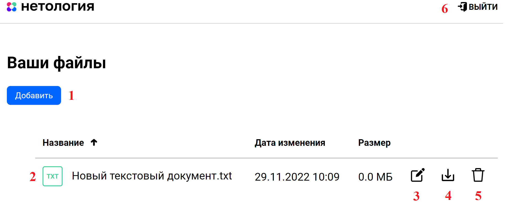

# [Дипломная работа “Облачное хранилище”](https://github.com/netology-code/jd-homeworks/blob/master/diploma/cloudservice.md)

## Описание проекта

REST-сервис предоставляет интерфейс для возможности загрузки файлов и вывода списка уже загруженных файлов пользователя
по [заранее описанной спецификации](CloudServiceSpecification.yaml).

Все запросы к сервису авторизованы.

Заранее подготовленное веб-приложение (FRONT) подключается к разработанному сервису без доработок,
а также использует функционал FRONT для авторизации, загрузки и вывода списка файлов пользователя.

Изначально FRONT доступен на порту 8080, BACKEND - на порту 8888.

Описание проекта "с картинками" смотри чуть ниже.

## Стартовые пользователи:

**USERNAME:** user@one.user **PASSWORD:** user_one

**USERNAME:** user@two.user **PASSWORD:** user_two

## Описание реализации:

- Приложение разработано с использованием Spring Boot;
- Использован сборщик пакетов Maven;
- Использована база данных MySql;
- Использована система управления миграциями Liquibase;
- Для запуска используется docker, docker-compose;
- Код размещен на github;
- Код покрыт unit тестами с использованием mockito;
- Добавлены интеграционные тесты с использованием testcontainers;
- Информация о пользователях сервиса хранится в базе данных;
- Информация о файлах пользователей сервиса хранится в базе данных.

## ВАЖНО!!!

[Интеграционный тест](src/test/java/ru/netology/NetologyCloudStorageApplicationTests.java) и
[JPA тесты](src/test/java/ru/netology/repository) (StorageFileRepositoryTest.java, UserRepositoryTest.java)
изначально закомментированы, поскольку с ними не получится выполнить maven-package, а также собрать docker-контейнер.
После сборки docker-контейнера требуется раскомментировать и запустить данные тесты.

## Запуск приложения

### Запуск FRONT:

1. Установить nodejs (версия не ниже 14.15.0) на компьютер [следуя инструкции](https://nodejs.org/ru/download/);
2. Скачать [FRONT](https://github.com/frepingod/netology-cloud-storage-front) (JavaScript);
3. Перейти в папку FRONT приложения и все команды для запуска выполнять из нее;
4. Следуя описанию README.md FRONT проекта запустить nodejs приложение (npm install...);
5. Для запуска FRONT приложения с расширенным логированием использовать команду: `npm run serve`.

### Запуск BACKEND:

1. Скачать данный проект, выполнить `maven -> clean -> package`;
2. Запустить `docker-compose.yml`.
Автоматически создадутся все необходимые в базе данных таблицы (с двумя стартовыми пользователями в таблице users).

### PS:

BACKEND можно запустить и через main метод в классе NetologyCloudStorageApplication.java,
не используя docker-контейнер. Базу данных же все равно запускать через docker-контейнер.

Для этого на п.2 "Запуск BACKEND" вместо запуска всего `docker-compose.yml` следует запустить
только `docker-compose.yml -> database`, а само приложение через main метод.
Остальные шаги остаются неизменны.

## Стартовая страница:

Стандартная форма авторизации для ввода логина (почта) и пароля. Добавить нечего.

## Страница после авторизации:

После авторизации будет доступна данная страница.
1. Добавление файла в облачное хранилище. После нажатия будет предложено выбрать файл для загрузки и загрузить его;
2. Список загруженных файлов. Изначально пуст;
3. Переименование файла. По нажатию будет сгенерировано случайное новое имя, состоящее из трех цифр;
4. Загрузить (скачать) файл с облачного хранилища;
5. Удалить файл;
6. В правом верхнем углу кнопка "Выйти" для выхода из своей учетной записи. По нажатию будет осуществлен автоматический переход на стратовую страницу.